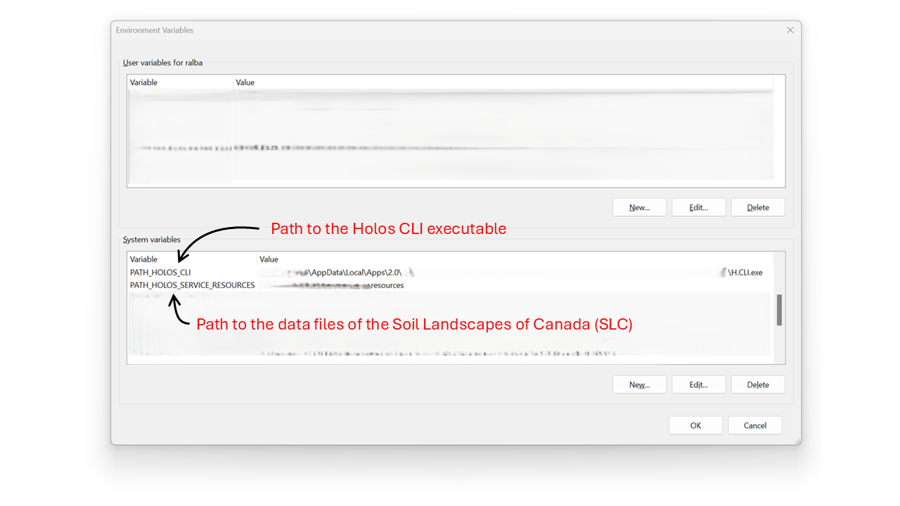
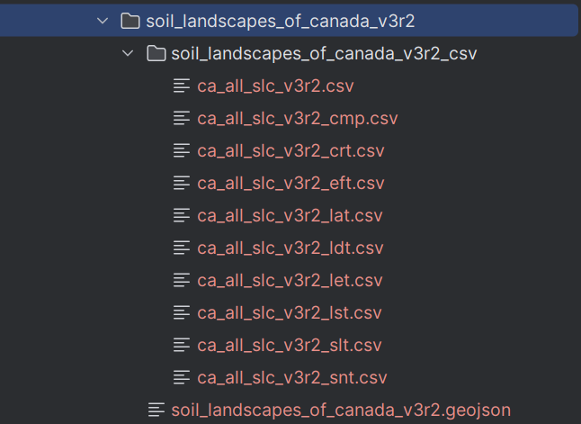

############
Installation
############

*********
Holos CLI
*********

Before using PyHolos, the user needs to install Holos CLI. This can be performed by hitting
`this link <https://agriculture.canada.ca/holos/cli/setup.exe>`__.

Once the installation terminated, the user needs to identify the location of the Holos CLI executable (H.CLI.exe) and
to add its path to the environment variables with the name **PATH_HOLOS_CLI**:

.. _fig_environment_variables:

    The environment variables that should be added so the system.
    The variable **PATH_HOLOS_CLI** is mandatory while **PATH_HOLOS_SERVICE_RESOURCES** is optional and depends on the
    intended usage of PyHolos (see :ref:`installation:Soil data files` below).

******************
The python package
******************
This package is not distributed yet. Therefore, the user needs to clone the source code in order to build it locally.

.. code-block:: bash

    cd <directory_where_pyholos_will_be_cloned>
    git clone git@github.com:Mon-Systeme-Fourrager/holos_service.git
    cd holos_service
    pip install -e .

***************
Soil data files
***************

.. |slc| replace:: `SLC <https://open.canada.ca/data/en/dataset/5ad5e20c-f2bb-497d-a2a2-440eec6e10cd>`__

Soil data is required when using PyHolos to create inputs for Holoc CLI. As in the C# source code of Holos, PyHolos uses
the data provided by the Soil Landscapes of Canada (|slc|).
Two types of data are required, respectively CSV and GeoJSON types.
The CSV files include soil information per polygon and can be downloaded by hitting "Pre-packaged CSV files" in |slc|
(downloads a zip file called "soil_landscapes_of_canada_v3r2_csv.zip").
The GeoJSON file includes complimentary spatially-identified soil information, downloadable by hitting
"Pre-packaged GeoJSON files" in |slc|
(downloads a zip file called "soil_landscapes_of_canada_v3r2_geojson.zip").

Once downloaded, the zip files must be extracted into a distinct directory and the path to this directory must be added
to the environment variables with the name **PATH_HOLOS_SERVICE_RESOURCES** (see :numref:`fig_environment_variables`).

    Organisation of the soil data files required to run PyHolos when the latter is used to create input files for
    Holos CLI.

